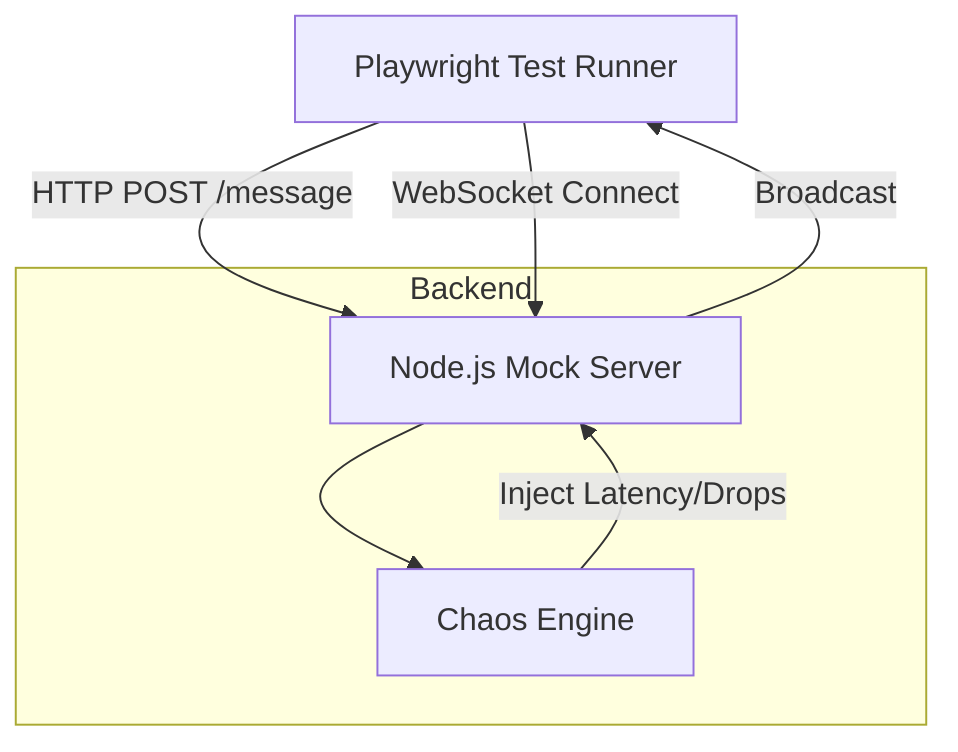

# System Architecture

## Overview
The Realtime Quality Lab simulates a distributed messaging system to validate quality attributes like reliability, latency handling, and fault tolerance.

## Diagram

## Components

### 1. Mock Server (`server/`)
- **Technology**: Node.js, Express, `ws` library.
- **Role**: Acts as the backend service. It supports hybrid protocols (REST + WebSockets).
- **Key Feature**: It does not just echo messages; it broadcasts them to simulate a chat room or notification system.

### 2. Chaos Engine (`server/chaos.ts`)
- **Role**: Intercepts outgoing WebSocket messages.
- **Capabilities**:
  - **Latency**: Delays message delivery by $N$ milliseconds.
  - **Packet Loss**: Probabilistically drops messages based on a configured `dropRate`.
- **Control**: Controlled via the `POST /chaos` endpoint, allowing tests to dynamically alter network conditions.

### 3. Test Client (`utils/socketClient.ts`)
- **Role**: A wrapper around the raw WebSocket client to make testing easier.
- **Features**:
  - `waitForMessage(pattern)`: Async polling to wait for specific messages.
  - Automatic history tracking.
  - Clean connection management.