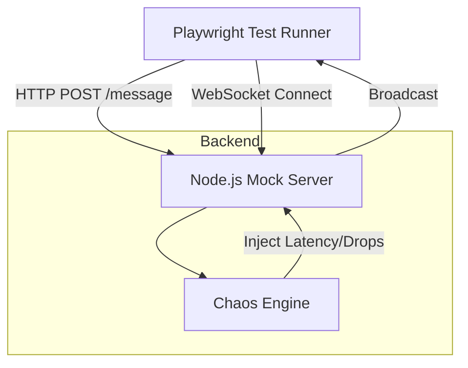

---
# System Architecture

## Overview

Realtime Quality Lab is a distributed testbed for validating reliability, latency, and fault tolerance in real-time messaging systems. It combines REST and WebSocket protocols, chaos engineering, and automated E2E testing.

## System Diagram

## Key Components

### 1. Mock Server (`server/`)
- **Node.js + Express + ws**
- Handles both REST and WebSocket traffic
- Broadcasts messages to all connected clients (simulates chat/notification system)
- Exposes `/chaos` endpoint for dynamic fault injection

### 2. Chaos Engine (`server/chaos.ts`)
- Intercepts outgoing WebSocket messages
- **Latency:** Delays delivery by configurable ms
- **Packet Loss:** Drops messages probabilistically via `dropRate`
- Controlled via REST API (`POST /chaos`)

### 3. Test Client (`utils/socketClient.ts`)
- Thin wrapper around WebSocket for test automation
- Features: `waitForMessage(pattern)`, message history, robust connect/disconnect

---
**See also:**
- [Test Strategy](test-strategy.md) for QA philosophy and scenario breakdown
- [README.md](../README.md) for quickstart and project structure
### 3. Test Client (`utils/socketClient.ts`)

- **Role**: A wrapper around the raw WebSocket client to make testing easier.
- **Features**:
  - `waitForMessage(pattern)`: Async polling to wait for specific messages.
  - Automatic history tracking.
  - Clean connection management.
